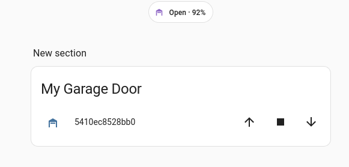

<a href="https://www.buymeacoffee.com/halacs" target="_blank"></a>

**ABSOLUTELY NO WARRANTY! USE AT YOUR OWN RISK!**

# Hörmann BiSecur Gateway CLI client and GoLang SDK

This command line client (CLI) and software developer kit (SDK) is able to communicate with your Hörmann BiSecur Gateway directly via IP connection.

You can discover gateways available on your LAN or you can specify its IP address directly if you are not in the same Layer 2 segment / broadcast domain to discover them. The letter is can be important if you can reach your home network via a Layer 3 VPN connection.

Never ever let your gateway reachable from the public internet, for example, with help of port forward! This gateway is very poor on security to do so! I strongly suggest to keep your gateway reachable only on your secure LAN network. For more details please refer to the sutdy of sec-consult in the links section.

Hörmann officially supported this gateway version until end of 2023 / beginning of 2024.


## TODOs
* [x] Create json output for machines. Improve documentation accordingly.
* [x] Add retries. `status` command produces `PORT_ERROR` quite frequently while second try works fine.
* [x] Improve token handling. Token is stored in `config.yaml` but it seems to be invalidated after a while. It should be renewed on demand.
* [x] Create GitHub pipeline for releases
* [x] Create new gateway user
* [x] Delete gateway user
* [x] Change password of a gateway user
* [ ] Assign new door to the gateway
* [ ] Delete assigned door from the gateway

## Usage
```
$ ./halsecur 
Application to manage your Hörmann BiSecur gateway without the central cloud directly on your LAN.

Usage:
  halsecur [command]

Available Commands:
  Logout      
  completion  Generate the autocompletion script for the specified shell
  discover    Discover Hörmann BiSecur gateways on the local network
  get-name    Queries the name of the Hörmann BiSecur gateway
  groups      Manages doors defined in your Hörmann BiSecur gateway.
  ha          Start MQTT client compatible with Home assistant auto discovery
  help        Help about any command
  login       
  ping        Check if your Hörmann BiSecur gateway is reachable or not.
  set-state   Open or close a door connected to your Hörmann BiSecur gateway.
  status      Queries the status (open/closed/etc) of your door.
  users       Manages users defined in your Hörmann BiSecur gateway.
  version     Print version information

Flags:
      --autologin         login automatically on demand (default true)
      --debug             debug Log level (default true)
  -h, --help              help for halsecur
      --host string       IP or host name or the Hörmann BiSecure gateway
      --json              use json logging format instead of human readable
      --mac string        MAC address of the Hörmann BiSecur gateway
      --password string   Valid password belongs to the given username
      --port int           (default 4000)
      --token uint32      Valid authentication token
      --username string   Valid username

Use "halsecur [command] --help" for more information about a command.
```

### Config file
`config.yaml` needs to be placed next to the application binary in the same directoy.

Below you can find an example configuration file works for me.

Please replace at least `host`, `mac`, `username` and `password` values to match with your setup.

As far as I know port if always 4000 so most probably it never need to be changed.

```bash
autologin: true
debug: false
deviceport: 0
host: 192.168.45.41
deviceport: 0
json: false
lastlogin: 0
mac: 54:10:EC:85:28:BB
mqttbasetopic: ADD-YOUR-MQTT-BASE-TOPIC
mqttdevicename: garage
mqttpassword: ADD-YOUR-MQTT-PASSWORD
mqttport: 8883
mqttserver: ADD-YOUR-MQTT-SERVER
mqttstricttlsvalidation: true
mqttteleperiod: 5s
mqtttls: true
mqttusername: ADD-YOUR-MQTT-USERNAME
password: ADD-YOUR-PASSWORD
port: 4000
token: 0
username: app
```

### Home Assistant MQTT auto discovery
To operate your door from Home Assistant, start this application with `ha` command.

It will connect to your BiSecur Gateway and will publish the door status and control commands to your MQTT server. Home Assistant will auto discover it.

```bash
$ ./dist/halsecur ha
INFO[2025-07-20T21:28:10+02:00] Connected                                    
INFO[2025-07-20T21:28:15+02:00] Token expired. Logging in...                 
INFO[2025-07-20T21:28:18+02:00] Door position: 0, direction: closed          
INFO[2025-07-20T21:28:21+02:00] Door position: 0, direction: closed          
^CINFO[2025-07-20T21:28:22+02:00] Exiting                                      
INFO[2025-07-20T21:28:22+02:00] Disconnected from MQTT server  
```



This is how it looks like in my Home Assistant instance with my custom card.

**NOTE1:** you need to change `entity` ID in the below example to match with your setup.

**NOTE2:** if you want confirmation before door opening/closing via HA, you need to install the `restriction-card` in `HAACS`. If the confirmation is not needed you can just use auto discovered entity card. 

```yaml
type: custom:hui-entities-card
entities:
  - card:
      entity: cover.5410ec8528bb0_5410ec8528bb0
    duration: 60
    restrictions:
      pin:
        code: 1234
        text: Garage Door
    type: custom:restriction-card
    row: true
```

### Run in Docker with Docker Compose
If you want to run this application in Docker, you can use the following `docker-compose.yaml` file.

```yaml
services:
  halsecure:
    container_name: halsecure
    image: "ghcr.io/halacs/halsecur:v2"
    command: [ "ha" ]
    volumes:
      - ./config.yaml:/config.yaml
    restart: unless-stopped
    #network_mode: host # needed only for BiSecure gateway discovery
```

### Ping
```bash
$ dist/halsecur ping --host 192.168.3.232 --mac 54:10:EC:85:28:BB --count 3 --delay 1000
INFO[2024-01-31T21:12:46+01:00] Response 1 of 3 received in 67 ms
INFO[2024-01-31T21:12:47+01:00] Response 2 of 3 received in 64 ms
INFO[2024-01-31T21:12:48+01:00] Response 3 of 3 received in 63 ms
```

### Get device name
```bash
$ ./dist/halsecur get-name
INFO[2024-03-29T21:20:03+01:00] Success                                       name="BiSecur Gateway"
```

### Login
```bash
$ ./dist/halsecur login
```

### Get users
```bash
$ ./dist/halsecur users groups
INFO[2024-03-29T21:20:36+01:00] Success                                       users="[{\"id\":0,\"name\":\"admin\",\"isAdmin\":true,\"Groups\":[]},{\"id\":1,\"name\":\"app\",\"isAdmin\":false,\"Groups\":[0]}]"
```

### Get groups
```bash
$ ./dist/halsecur groups groups
INFO[2024-03-29T21:20:55+01:00] [{"id":0,"name":"garazs","ports":[{"typeName":"IMPULS","id":0,"type":1}]}] 
```

### Get door status
```bash
$ ./dist/halsecur status --devicePort 0
INFO[2024-03-29T21:21:11+01:00] Token expired. Logging in...                 
INFO[2024-03-29T21:21:11+01:00] Token: 0x53972BFB                            
INFO[2024-03-29T21:21:12+01:00] Success                                       status="{\"StateInPercent\":0,\"DesiredStateInPercent\":0,\"Error\":false,\"AutoClose\":false,\"DriveTime\":0,\"Gk\":257,\"Hcp\":{\"PositionOpen\":false,\"PositionClose\":true,\"OptionRelais\":false,\"LightBarrier\":false,\"Error\":false,\"DrivingToClose\":false,\"Driving\":false,\"HalfOpened\":false,\"ForecastLeadTime\":false,\"Learned\":true,\"NotReferenced\":false},\"Exst\":\"AAAAAAAAAAA=\",\"Time\":\"2024-03-29T21:21:12.719862537+01:00\"}"
```

### Open/close door
Door is fully closed. Start to open it:

```bash
$ ./dist/halsecur set-state --devicePort 0
INFO[2024-03-29T21:22:00+01:00] Success
```

Door is opening. Stop it in a half-open position:

```Bash
$ ./dist/halsecur set-state --devicePort 0
INFO[2024-03-29T21:22:07+01:00] Success
```

Door is half-opened. Close it back:

```Bash
$ ./dist/halsecur set-state --devicePort 0
INFO[2024-03-29T21:22:42+01:00] Success 
```

## Acknowledgement

Thanks for [SEC Consult](https://sec-consult.com/blog/detail/hoermann-opening-doors-for-everyone/) for the initial analysis and documentation.

Based on the above study someone could create a [Kotlin SDK](https://github.com/bisdk/sdk) which also helped me a lot.

Taken into consideration that Hörmann will stop their cloud required for BiSecur Gateway usages from 2024, I asked Hörmann support to publish their protocol already leaked in above repositories, but they stated that this code is impossible to write.

## Contribution

Please feel free to implement the missing commands in the SDK or in the CLI application.

When you are done with it please raise a pull request. I will do my best to merge to the upstram as soon as possible.

Whenever you raise a pull request please try to keep test coverage as high as possible and describe clearly what is the feature you have implemented and how you tested it.

## Disclaimer

**ABSOLUTELY NO WARRANTY! USE AT YOUR OWN RISK!**

This software is provided by Halacs "as is" and "with all faults." Halacs makes no representations or warranties of any kind concerning the safety, suitability, lack of viruses, inaccuracies, typographical errors, or other harmful components of this software. There are inherent dangers in the use of any software, and you are solely responsible for determining whether this software is compatible with your equipment and other software installed on your equipment. You are also solely responsible for the protection of your equipment and backup of your data, and Halacs will not be liable for any damages you may suffer in connection with using, modifying, or distributing this software.

**NO LIABILITY FOR CONSEQUENTIAL DAMAGES**

To the maximum extent permitted by applicable law, in no event shall Halacs be liable for any direct, indirect, punitive, incidental, special, consequential damages or any damages whatsoever including, without limitation, damages for loss of use, data, or profits arising out of or in any way connected with the use or performance of this software, with the delay or inability to use this software, or for any information obtained through this software.

**NO RESPONSIBILITY FOR THIRD-PARTY COMPONENTS**

This software may include third-party software components subject to their own licenses. Halacs disclaims any responsibility or liability related to the inclusion, functionality, or use of such third-party components.

**DISCLAIMER SPECIFIC TO BiSecur Gateway**

By using this software, you acknowledge that it was developed with the best intentions; however, it may lead to the BiSecur Gateway device becoming inoperable, or the associated physical door may open or remain open. Halacs explicitly disclaims any responsibility or liability for such events. It is your responsibility to ensure the proper functioning and security of the BiSecur Gateway device and the connected physical door. If you do not agree to these terms, you may not use, modify, or distribute this software.

## Links
- https://sec-consult.com/blog/detail/hoermann-opening-doors-for-everyone/
- https://github.com/bisdk/sdk
